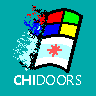

# ChiDoors

**Win95-style Icon Set**

---

**ChiDoors ** *("[Chicago ](https://en.wikipedia.org/wiki/Windows_95#Development)Doors")* is an icon set that tries to recreate the look of Windows 95's desktop icons. The intention behind this is to enable users of modern systems (and especially Windows 95-style themes such as [Chicago95](https://github.com/grassmunk/Chicago95)) to emulate the aesthetic of the older Windows versions more completely by providing icons for newer programs that fit with this style.

While these may use some of the original Win95 ico's as a base (such as the file icon), **all icons in this repo must be original**. Please don't just recolor the base Win95 icons and push them here. With that being said, do feel free to look at [the original icons](https://win98icons.alexmeub.com/) for inspiration.

## Standards

### Design

To keep the look of the icons consistent, please make sure your additions meet these standards:

* .ico file type
* 32x32 image size
* Paletted to the [Standard VGA Palette](https://en.wikipedia.org/wiki/Video_Graphics_Array#/media/File:VGA_palette_with_black_borders.svg)

### Naming

To ensure that any icon can be easily searched for, use this naming scheme:

`[Author] . [Program Name] - [Variant]`

for example, for Steam, use

`Valve.Steam.ico`

if a base icon for a program already exists and you want to add a variant, suffix a variant name to its name with a dash. So for our example, you might use

`Valve.Steam-Dark.ico`

If you're in doubt about the author of a program, not sure which to use, or just want to quickly look it up, I would recommend using the IDs off the [winget-pkgs](https://github.com/microsoft/winget-pkgs) repo, after which this scheme is modeled.

